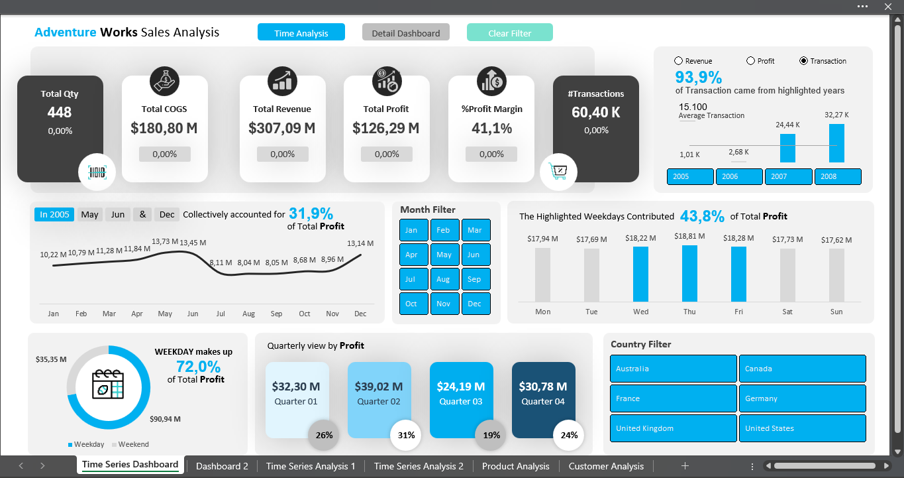
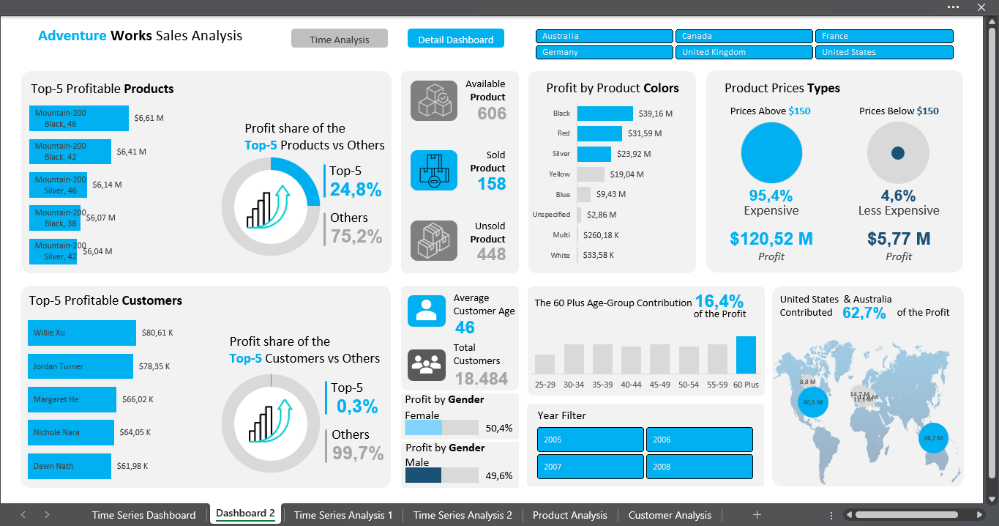

# 📊 Adventure Works Sales Analysis — Advanced Excel Dashboard

[](#)
[](#)
[](#)

An Excel-based **sales analytics and dashboarding project** using the Adventure Works dataset to analyze revenue, profitability, product performance, customer contribution, and time-based trends. The project demonstrates practical **Advanced Excel skills** through formula-driven analysis, lookup and ranking functions, helper tables, dynamic KPI calculations, and interactive dashboard design. The goal is to transform transactional data into concise business insights using Microsoft Excel.

---

## 📑 Table of Contents

- [Dashboard Preview](#-dashboard-preview)
- [Dashboard Demo](#-dashboard-demo)
- [About This Project](#-about-this-project)
- [Advanced Excel & BI Techniques](#-advanced-excel--bi-techniques)
- [Key Findings](#-key-findings)
- [Dashboard Pages](#-dashboard-pages)
- [Interactive Features](#️-interactive-features)
- [How to Use](#-how-to-use)
- [Repository Structure](#-repository-structure)
- [Contact](#-contact)

---

## 🎬 Dashboard Preview

### 📈 Time Series Dashboard


### 👥 Product & Customer Analysis


---

## 🎥 Dashboard Demo
Watch a short walkthrough of the interactive Excel dashboard, including filtering, dynamic metric selection, dashboard navigation, and KPI updates.
[▶️ Watch Dashboard Demo](https://youtu.be/5O523CglT04)

---

## 📌 About This Project
**Objective**   
Build an end-to-end Excel sales dashboard that's functionally on par with a Power BI dashboard — complete with a relational data model, DAX calculations, and multi-page navigation — to show that Excel can be a serious BI tool, not just a static spreadsheet.

**Methodology**  
Raw AdventureWorksDW data was cleaned with **Power Query** (one query per table), loaded into the **Data Model (Power Pivot)**, and connected in a **star schema** (`FactInternetSales` as the fact table, with 5 dimension tables around it). Every core metric is computed as a **DAX measure** (not a static column) so it recalculates automatically with the active slicer selection. Visuals are built from a combination of **PivotTable + PivotChart + Slicer**, restyled to resemble a modern dashboard layout. Cross-dashboard navigation and the Clear Filter button run on a **VBA macro** that resets every `SlicerCache`.

---

## 🧩 Advanced Excel & BI Techniques  
| Category | Tools |
| --- | --- |
| **Data Preparation** | Power Query |
| **Data Modeling** | Power Pivot (Data Model), star schema |
| **Calculations** | DAX (CALCULATE, SUMX, FILTER, DIVIDE, etc.) |
| **Visualization** | PivotTable, PivotChart, native Excel Charts |
| **Interactivity** | Slicers, Metric Selector, Dashboard Navigation |
| **Automation** | VBA Macro (navigation & Clear Filter) |

### Advanced Excel Formulas  
Alongside the Power Pivot / DAX layer, the workbook's helper tables and KPI calculations rely on classic Excel formulas:  
| Area | Functions |
| --- | --- |
| **Lookup & Reference** | `VLOOKUP`, `INDEX`, `MATCH` |
| **Conditional Logic** | `IF`, `IFS`, `IFERROR` |
| **Ranking & Aggregation** | `LARGE`, `SUM`, `AVERAGE`, `COUNTA` |
| **Analytical Calculations** | YoY comparison, profit contribution %, margins, ratios |

### Data Model  
The workbook uses a **star schema** with `FactInternetSales` as the central fact table connected to:  
- `DimDate`
- `DimProduct`
- `DimCustomer`
- `DimGeography`
- `DimSalesTerritory`  

This structure allows transaction-level sales to be analyzed across time, products, customers, and geographic dimensions.

---

## 📊 Key Findings

### 1. Steady revenue and profit growth, peaking in 2007
Revenue grew from **$33.37M in 2005** to a peak of **$102.38M in 2007**, before easing slightly to **$101.86M in 2008**. Profit followed the same pattern, rising from **$13.40M to $42.55M** over the same stretch. Profit margin stayed consistently in the **40–42%** range across all four years, indicating growth came from volume rather than eroding or expanding margins.

### 2. Q2 is the strongest quarter, driven by a May peak
**Q2 contributed 31% of total profit ($39.02M)** — the highest of any quarter — followed by Q1 (26%), Q4 (24%), and Q3 (19%, the weakest). At the monthly level, **May was the single highest-profit month ($13.73M)**, with June ($13.45M) and December ($13.14M) close behind.

### 3. Profit is concentrated among a small group of products
The **Top-5 products generated 24.8% of total profit**, led by Mountain-200 variants — a small slice of the 606-product catalog, while the remaining products (Others) account for the other 75.2%.

### 4. Weekday sales contribute the majority of profit
**Weekdays contributed 72% of total profit ($90.94M)**, with **Wednesday–Friday alone accounting for 43.8%**, indicating that profitability is concentrated toward the middle and end of the working week.

### 5. Customer profitability is broadly distributed
The **Top-5 customers contributed only 0.3% of total profit** (Others: 99.7%), indicating overall profitability is not dependent on a small number of individual customers — a much healthier concentration profile than the product side.

---

## 📊 Dashboard Pages

### Time Series Dashboard  
Provides an overview of:  
- Revenue, Profit, COGS, Margin, Transactions, and Quantity KPI cards
- Year-level performance with a dynamic Revenue / Profit / Transaction metric selector
- Monthly profit trend and quarterly profit distribution
- Weekday vs. weekend contribution

### Product & Customer Dashboard  
Provides:  
- Top-5 profitable products and customers
- Product availability analysis (Available / Sold / Unsold)
- Profit by product color and by price group
- Profit contribution by age and gender
- Country-level profit contribution

### Supporting Analysis  
`Time Series Analysis 1 & 2`, `Product Analysis`, and `Customer Analysis` — more granular PivotTable/PivotChart views that feed the two main dashboards above.

---

## 🎛️ Interactive Features

- **Global Slicers:** filter by Country, Year, and Month.
- **Dynamic Metric Selection:** switch between Revenue, Profit, and Transactions without creating separate charts.
- **Cross-Filtering:** selecting a category or data point updates related calculations and contribution metrics.
- **Dashboard Navigation:** VBA buttons to move between dashboard pages.
- **Clear Filter:** VBA resets all active slicer selections with one click.

---

## 🚀 How to Use

1. Download `Dashboard_Master_Class_AdventureWorksSales.xlsm` from this repository.
2. Open the workbook in **Microsoft Excel Desktop** and enable macros when prompted (`Enable Content`).
3. Use the slicers to explore the dashboard by Country, Year, and Month.
4. Use the navigation buttons to switch between dashboard views, or **Clear Filter** to reset.
5. Open **Data → Queries & Connections** (Power Query) and **Power Pivot → Manage Data Model** to inspect the underlying calculations.

> **Dataset note:** Adventure Works is a sample dataset used to demonstrate Advanced Excel and BI capabilities. This project is intended as a portfolio case study rather than an analysis of current market conditions.

---

## 📂 Repository Structure

```text
adventureworks-excel-sales-analysis/
├── README.md
├── LICENSE
├── Data/
│   └── AdventureWorks.xlsx
├── assets/
│   ├── time_series_dashboard_overview.png
│   └── detail_dashboard_by_product_&_customer.png
└── Dashboard_Master_Class_AdventureWorksSales.xlsm
```

---

## 📬 Contact

Open to opportunities related to **Data Analyst, Business Intelligence, and Analytics** roles.

* **LinkedIn:** [linkedin.com/in/gloryanisveronicalase](https://linkedin.com/in/gloryanisveronicalase)
* **Email:** [gloryanislase@gmail.com](mailto:gloryanislase@gmail.com)
